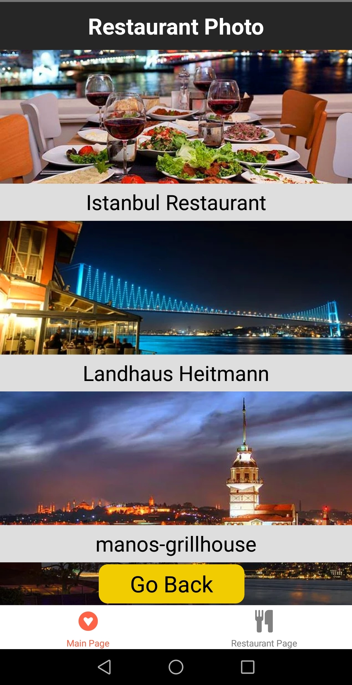
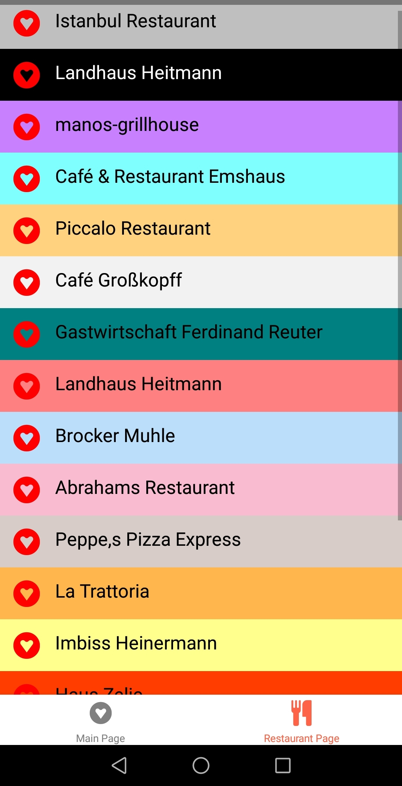
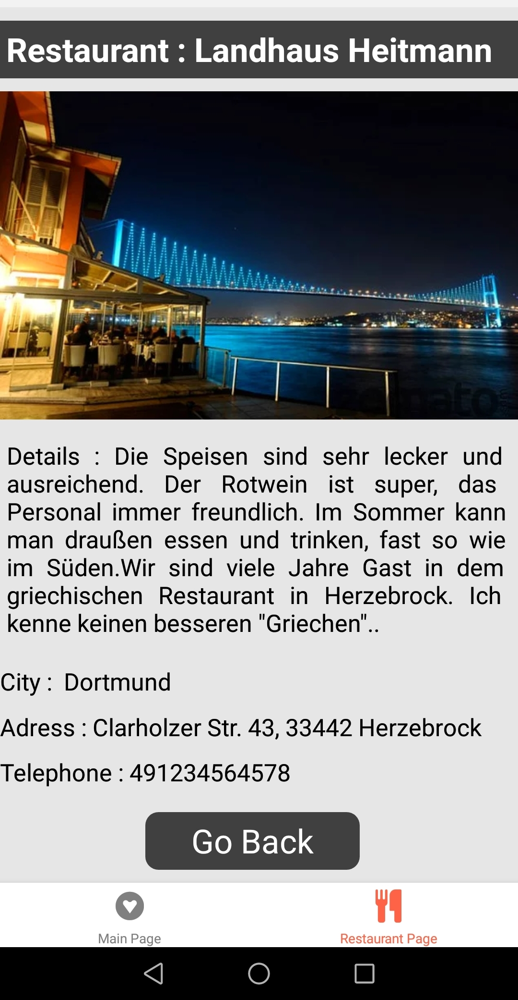

<h1 align="center">Restaurant Page with React-Native</h1>

Project aims to create Yelp Alternative Application with React Native.

## Description

Project aims to create Yelp Alternative Application with React Native.


 
 

### At the end of the project, following topics are to be covered;

- HTML
- CSS
- JS
- [React](https://reactjs.org/)
- [React-Native](https://reactnative.dev/)
- [React-Navigation](https://reactnavigation.org/)


## How To Use

To clone and run this application, you'll need [Git](https://git-scm.com) and [Node.js](https://nodejs.org/en/download/) (which comes with [npm](http://npmjs.com)) installed on your computer. From your command line:

```bash

$ git clone https://github.com/Talha-35/Restaurant-Page-React-Native.git

$ npm install

$ npx react-native run-android

$ npm install @react-navigation/native

$ npm install react-native-reanimated react-native-gesture-handler react-native-screens react-native-safe-area-context @react-native-community/masked-view

$ npm install @react-navigation/stack

$ npm install --save react-native-vector-icons

$ npm install @react-navigation/bottom-tabs

```

## Contact

- GitHub [@Talha](https://github.com/Talha-35)
- Linkedin [@Talha](https://www.linkedin.com/in/talha-%C3%BClk%C3%BCmen-4854391b8/)

